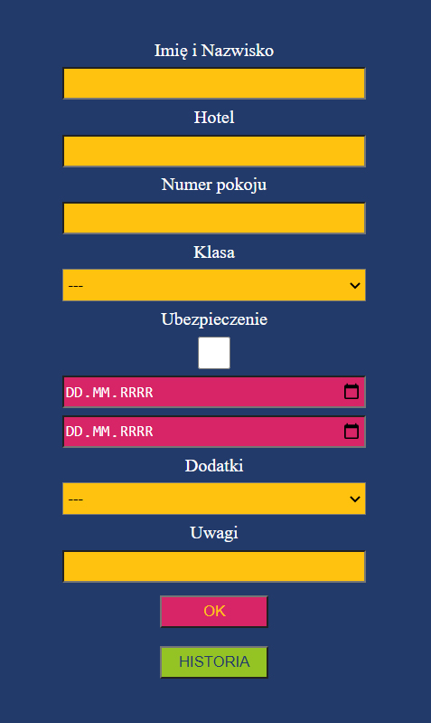

# cars_rental
> Simple app which helps in car renting. It simplifies work of holiday representative.

## Table of contents
* [Colors key](#colors-key)
* [General info](#general-info)
* [Screenshots](#screenshots)
* [Technologies](#technologies)
* [Features](#features)
* [Inspiration](#inspiration)
* [Contact](#contact)

## Colors-key

## General info

This app helped me in my work on greek island Corfu. I worked as holiday representative and every single day I collected many car rental orders from tourists. I talking on the phone and I needed to write down all informations. So I made this app and I was using it on my second phone. This app saves all data to localstorage so it is possible to check all previous orders.

## Screenshots

### Main view

## Technologies
* HTML
* CSS
* Javascript

## Features

Live demo https://przemek-szadkowski.github.io/cars_rental/

## Status
Project is: finished

## Inspiration
Project inspired by my every day work on greek island Corfu.

## Contact
Created by [przemoszadkowski@o2.pl](mailto:user@example.com) - feel free to contact me!